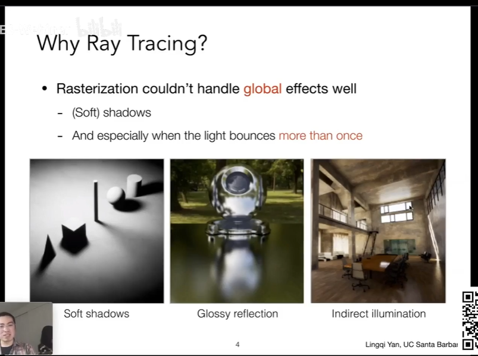
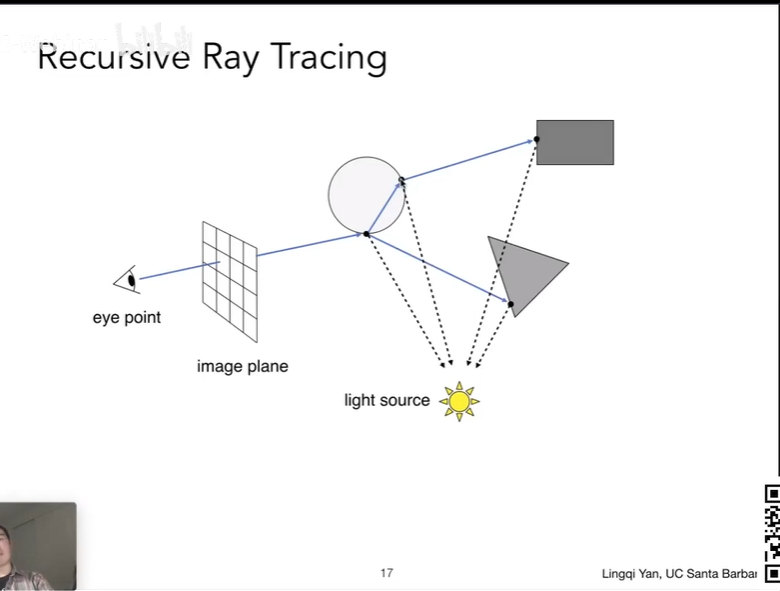

# GAME 101
## 10 - Geometry 1
- Environment Map
- 犹他茶壶
- 康奈尔盒子
- Displacement mapping and normal mapping
- DX 曲面细分
- Ambient Occlusion texture map
- 3D texture
## 13 - Ray Tracing 1
- Whitted-Style Ray Tracing
  - Soft shadows
  - Glossy reflection
  - Indirect illumination
  - 
  - 3 ideas about light rays
    - Light travels in straight lines(though this is wrong)
    - Light rays do not "collide" with each other(still wrong)
    - Light rays travel from the light sourcs to the eye(but the physics is invariant under path reversal - reciprocity光路可逆性)
    - Ray Casting - Generating Eye Rays
    - Recursive(Whitted-Style) Ray Tracing
    - 