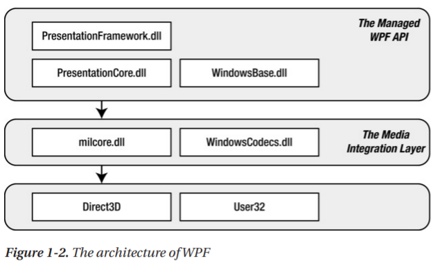
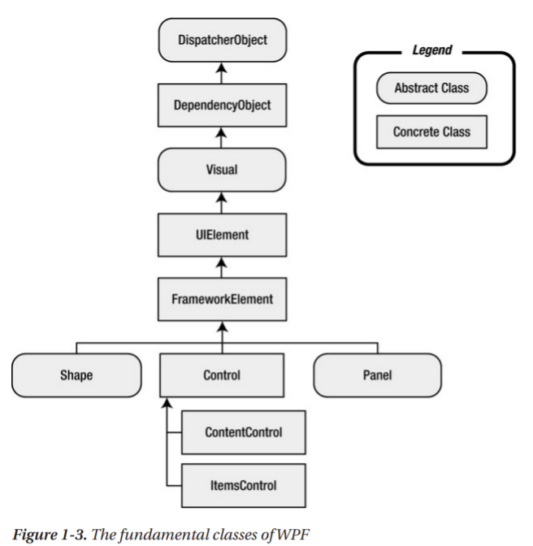
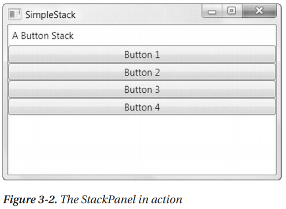
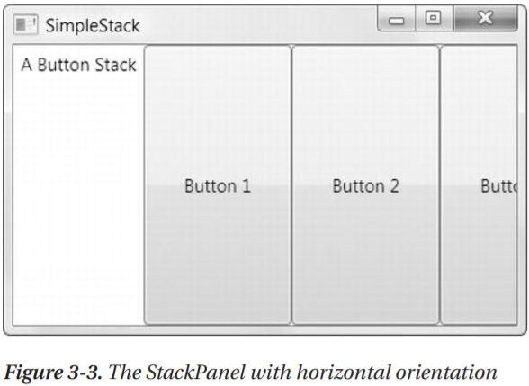
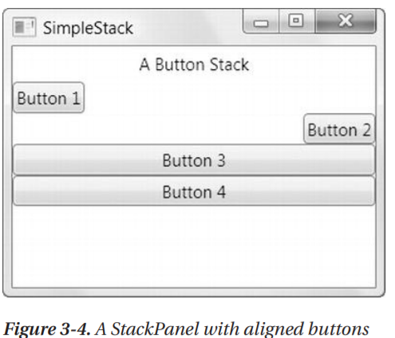
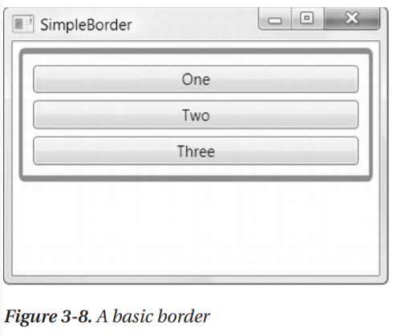

# Pro WPF 4.5 in C#
## Chapter 1 - Introducing WPF
Windows Presentation Foundation
### The Evolution of Windows Graphics
Pre WPF
- User32 : windows, buttons and so on
- GDI/GDI+ : drawing text, shapes, images
#### DirectX : new graphics engine
- DirectX is WPF underlying graphics engine
#### Hardware acceleration and WPF
Hardware and Software(fallback) renderring
### WPF : A Higher-Level API
- A web-like layut model
- A rich drawing model
- A rich text model
- Animation as a first-class programming concept
- Support for audio and video media
- Styles and templates
- Commands
- Declarative user interface
- Page-based applications
### Resolution Independence
120 dpi or 144 dpi or 96, same size button
#### WPF Units
using _device-independent units_. A single device-independent unit is defined as 1/96 of an inch
#### System DPI
#### Bitmap and Vector Graphics
- using bitmap for toolbar is not ideal(maybe blurry), vector is better
### The Architecture of WPF

- PresentationFramework.dll : top-level WPF types, windows, panels, controls
- PresentationCore.dll : This holds base types, UIElement and Visual and so on(Shapes and Controls derive)
- WindowsBase.dll : more basic ingredients and protential reused outside of WPF, DispatcherObject and DependencyObject
- milcore.dll : Media Integration Layer
- WindowsCodecs.dll : low-level API provide imaging support(for example, processing, displaying, and scaling bitmaps and JPEGs)
- Direct3D : graphics API
- User32
#### The Class Hierarchy

- **System.Threading.DispatcherObject** : WPF use STA(single thread affinity)
- **System.Windows.DependencyObject** : more powerful property model
- **System.Windows.Media.Visual**
- **System.Windows.UIElement** : layout, input, focus, events(LIFE)
- **System.Windows.FrameworkElement**
- **System.Windows.Shapes.Shape** : rectangle, polygon, ellipse, line, path
- **System.Windows.Controls.Control** : TextBox, Button, ListBox
- **System.Windows.Controls.ContentControl**
- **System.Windows.Controls.ItemsControl** : ListBox, TreeView
- **System.Windows.Control.Panel**
### WPF 4.5
#### The WPF Toolkit
#### Visual Studio 2012
## Chaper 2 - XAML
XAML documents define the arrangement of panels, buttons, and controls that make up the windows in a WPF application.
### Understanding XAML
#### Graphical User Interfaces Before WPF
- XAML opens up worlds of possibilites for collaboration, because other design tools understand the XAML format(for example, Microsoft Expression Design)
#### The Variants of XAML
- XAML is and all-purpose XML-based syntax for representing a tree of .NET objects
- Subsets of XAML
    - WPF XAML
    - XPS XAML part of WPF XAML, defines XML representation for formatted electronic documents(XML Paper Specification)
    - Silverlight XAML, subset of WPF XAML
    - WF XAML, Workflow foundation
#### XAML Compilation
- XAML Compiles to BAML(Binary representation of XAML)
### XAML Basics
- every element in a XAML document maps to an instance of a .NET class.
- you can nest one element inside another.
- you can set the properties of each class through attributes
- Three can be the top : 
    - Window
    - Page
    - Application
#### XAML Namespace
- xmlns="http://schemas.microsoft.com/winfx/2006/xaml/presentation"
    - encompasses all the WPF classes
- xmlns:x="http://schemas.microsoft.com/winfx/2006/xaml"
    - XAML utility features, prefix x : ElementName
- they **don't** point to a location on the Web
#### The Code-Behind Class
- <Window x:Class="WindowsApplication1.Window1"
    - x namespace prefix places the class attribute in XAML namespace
    - tells the XAML parser to generate a new class with the specified name, which derives from the class that's named by the XML element.
    - in this case, Window1 is created, derives from the base Window class.
#### The InitializeComponent() Method
- if you add another constructor to your window class, make sure InitializeComponent is called.
#### Naming Elements
- x:Name is field name in generated code
- Name is the Name property of the field
### Properties and Events in XAML
- The XAML parser follows two steps to find a type converter
    - examines the property declaration
    - checks the class declaration of corresponding data type
- Complex Properties
```xml
<Grid Name="grid1">
  <Grid.Background>
    <LinearGrandientBrush>
      <LinearGradientBrush.GradientStops>
        <GradientStop Offset="0.00" Color="Red" />
        <GradientStop Offset="0.50" Color="Indigo" />
        <GradientStop Offset="1.00" Color="Violet" />
      </LinearGradientBrush.GradientStops>
    </LinearGrandientBrush>
  </Grid.Background>
</Grid>
```
- Markpu Extensions
```xml
<Button ... Foreground="{x:Static SystemColors.ActiveCaptionBrush}">
```
- Attached Properties
```xml
<Text Box ... Grid.Row="0"> // txtQuestion.SetValue(Grid.RowProperty, 0);
  [Place question here]
</Text>
<Button ... Grid.Row="1">
  Ask the Eight Ball
</Button>
<TextBox ... Grid.Row="2">
  [Answer will ppear here.]
</TextBox>
```
- Nesting Elements
    - If the parent implements IList, the parser calls IList.Add() and passes in child
    - If the parent implements IDictionary, the parser calls IDictionary.Add()
    - if the parent is decorated with the ContentProperty
- Special Characters and Whitespace
    - Less than(<) &lt;
    - Greater than(>) &gt;
    - Ampersand(&) &amp;
    - Quotation mark(") &quot;
- Events
```xml
<Button ... Click="cmdAnswer_Click">
```
```cs
private void cmdAnswer_Click(object sender, RoutedEventArts e)
{
    this.Cursor = Cursors.Wait;
    // Dramatic delay...
    System.Threading.Thread.Sleep(TimeSpan.FromSeconds(3));
    AnswerGenerator generator = new AnswerGenerator();
    txtAnswer.Text = generator.GetRandomAnswer(txtQuestion.Text);
    this.Cursor = null;
}
```
### Using Types from Other Namespaces
```xml
<Window x:Class="WindowsApplication1.Window1"
  xmlns="http://schemas.microsoft.com/winfx/2006/xaml/presentation"
  xmlns:x="http://schemas.microsoft.com/winfx/2006/xaml"
  xmlns:sys="clr-namespace:System;assembly=mscorlib"
  Width="300" Height="300"
  >
  <ListBox>
    <ListBoxItem>
      <sys:DateTime>10/13/2013 4:30 PM</sys:DateTime>
    </ListBoxItem>
    <ListBoxItem>
      <sys:DateTime>10/29/2013 12:30 PM</sys:DateTime>
    </ListBoxItem>
    <ListBoxItem>
      <sys:DateTime>10/30/2013 2:30 PM</sys:DateTime>
    </ListBoxItem>
  </ListBox>
</Window>
```
### Loading and Compiling XAML
- three distinct coding styles that you can use to create a WPF application:
    - Code-only : trditional Windows Forms Approach
    - Code and uncompiled markup(XAML)
    - Code and compiled markup(BAML)
#### Code-Only
```cs
using System.Windows;
using System.Windows.Controls;
using System.Windows.Markup;

public class Window1 : Window {
  private Button button1;

  public Window1() {
    InitializeComponent();
  }

  private void InitializeComponent() {
    // Configure the form.
    this.Width = this.Height = 285;
    this.Left = this.Top = 100;
    this.Title = "Code-Only Window";

    // Create a container to hold a button
    DockPanel panel = new DockPanel();

    // Create the button
    button1 = new Button();
    button1.Content = "Please click me";
    button1.Margin = new Thickness(30);

    // Attach the event handler
    button1.Click += button1_Click;

    // Place the button in the panel.
    IAddChild container = panel;
    container.AddChild(button1);

    // Place the panel in the form
    container = this;
    container.AddChild(panel);
  }

  private void button1_Click(object sender, RoutedEventArgs e) {
    button1.Content = "Thank you.";
  }
}
```
```cs
public class Program : Application {
  [STAThread()]
  static void Main() {
    Program app = new Program();
    app.MainWindow = new Window1();
    app.MainWindow.ShowDialog();
  }
}
```
#### Code and Uncompiled XAML
```xml
<DockPanel xmlns="http://schemas.microsoft.com/winfx/2006/xaml/presentation">
  <Button Name="button1" Margin="30">Please click me.</Button>
</DockPanel>
```
```cs
using System.Windows;
using System.Windows.Controls;
using System.Windows.Markup;
using System.IO;

public class Window1 : Window {
  private Button button1;

  public Window1() {
    InitializeComponent();
  }
  public Window1(string xamlFile) {
    // Configure the form
    this.Width = this.Height = 285;
    this.Left = this.Top = 100;
    this.Title = "Dynamically Loaded XAML";

    // Get the XAML content from and external file
    DependencyObject rootElement;
    using (FileStream fs = new FileStream(xamlFile, FileMode.Open)) {
      rootElement = (DependencyObject)XamlReader.Load(fs);
    }

    // Insert the markup into this window
    this.Content = rootElement;

    // Find the control with the appropriate name.
    button1 = (Button)LogicalTreeHelper.FindLogicalNode(rootElement, "button1");
    // equivalent approach:
    // FrameworkElement frameworkElement = (FrameworkElement)rootElement;
    // button1 = (Button)frameworkElement.FindName("button1");

    // Wire up the event handler.
    button1.Click += button1_Click;
  }

  private void button1_Click(object sender, RoutedEventArgs e) {
    button1.Content = "Thank you.";
  }
}
```
#### Code and Compiled XAML
- two files will be generated
  - baml
  - xxxx.g.cs(__g__ means __generated__), as a partial class
#### XAML Only
- loose XAML
## Chapter 3 - Layout
- In WPF, you shape layout by using different __containers__
### Understanding Layout in WPF
- Most applications will use weblike flow layouts
#### The WPF Layout Philosophy
- Window class is derive from ContentControl
- ideal WPF window follows principles:
  - Elements(such as controls) should not be explicitly sized
  - Elements do not indicate their position with screen coordinates
  - Layout containers "share" the available space among theirs children
  - Layout containers can be nested
#### The Layout Process
- WPF layout takes place in two stages
  - measure stage : containers loops through children and asks them to provide their preferred size
  - arrange stage : places the child elements in the appropriate position
- ScrollViewer : provide scroll support
#### The Layout Containers
- Public Properties of the Panel Class
  - Background : brush used to paint the panel background
  - Children
  - IsItemsHost : true if the panel is being use to show the items that are associated with and ItemsControl
- Core Layout Panels
  - StackPanel
    - horizontal or vertical stack
  - WrapPanel
    - wrapped lines
  - DockPanel
    - against an entire edge of the container
  - Grid
    - arrange according to and invisible table
  - UniformGrid
    - in table but forces all cells to have the same size
  - Canvas
    - position absolutely by using fixed coordinates
  - Other Layout Panels
    - TabPanel, ToolbarPanel, ToolbarOverflowPanel, VirtualizingStackPanel, InkCanvas...
### Simple Layout with the StackPanel
```xml
<Window x:Class="Layout.SimpleStack"
  xmlns="http://schemas.microsoft.com/winfx/2006/xaml/presentation"
  xmlns="http://schemas.microsoft.com/winfx/2006/xaml"
  Title="Layout" Height="223" Width="354">
  <StackPanel>
    <Label>A Button Stack</Label>
    <Button>Button 1</Button>
    <Button>Button 2</Button>
    <Button>Button 3</Button>
    <Button>Button 4</Button>
  </StackPanel>
</Window>
```

```xml
<StackPanel Orientation="Horizontal">
```

#### Layout Properties
- HorizontalAlignment : Center, Left, Right, Stretch
- VerticalAlignment : Center, Top, Bottom, Stretch
- Margin
- MinWidth and MinHeight
- MaxWidth and MaxHeight
- Width and Height
#### Alignment
```xml
<StackPanel>
  <Label HorizontalAlignment="Center">A Button Stack</Label>
  <Button HorizontalAlignment="Left">Button 1</Button>
  <Button HorizontalAlignment="Right">Button 2</Button>
  <Button>Button 3</Button>
  <Button>Button 4</Button>
</StackPanel>
```

#### Margin
```xml
<Button Margin="5">Button 3</Button> // cmd.Margin = new Thickness(5);
<Button Margin="5,10,5,10">Button 3</Button> // left,top,right,bottom
```
#### Minimum, Maximum, and Explicit Sizes
```xml
<Window SizeToContent="WidthAndHeight"> // similar to UGUI ContentSizeFitter
```
#### The Border
- Properties of the Border Class
  - Background : Brush
  - BorderBrush and BorderThickness
  - CornerRadius
  - Padding : between border and content(margin is outside)
```xml
<Border Margin="5" Padding="5" Background="LightYellow" BorderBrush="SteelBlue" BorderThickness="3,5,3,5" CornerRadius="3" VerticalAlignment="Top">
  <StackPanel>
    <Button Margin="3">One</Button>
    <Button Margin="3">Two</Button>
    <Button Margin="3">Three</Button>
  </StackPanel>
</Border>
```

### Wrap Panel and Dock Panel