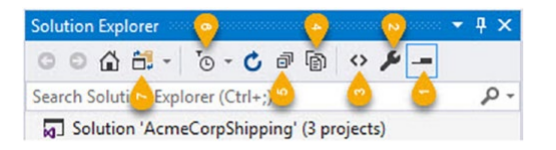
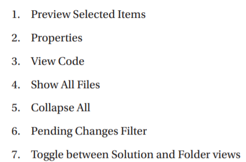

# VS2019
## Chapter 1
  
  
"Show all files" will show obj and bin
## Chapter 2 Work with Visual Studio 2019
### Visual Studio Project Types
#### Windows Service
Application run background, monitor specific event
- OnStart method is important
- System.Timers.Timer is update(dt) in a specific interval
- Elasped event is important
#### Web Applications
- ASP.NET project is to be created
#### Class Library
### Managing NuGet Package
- .nupkg
#### Using NuGet in Visual Studio
- Manager NuGet Packages in context menu
#### Host your own NuGet feed
Need:
- local feed
- NuGet Server
- NuGet Gallery  
Other
- Azure Artifacts
- MyGet : https://myget.org
- ProGet : https://inedo.com/proget
- Team City : www.jetbrains.com/teamcity
### Creating Project Template
- Menu : Project -> Export Template
### Creating and Using Code Snippets
- Menu : Tools -> Code Snippets Manager
### Using Bookmarks and Code Shortcuts
### The Server Explorer
- Menu : View -> Server Explorer
### Run SQL Query
### Visual Studio Window
#### C# interact
#### Code Metrics Result
## Chapter 3 Debug Your Code
## Chapter 4 Unit Testing
## Chapter 5 Source Control